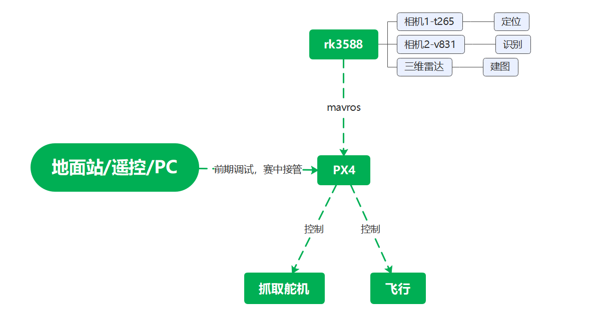
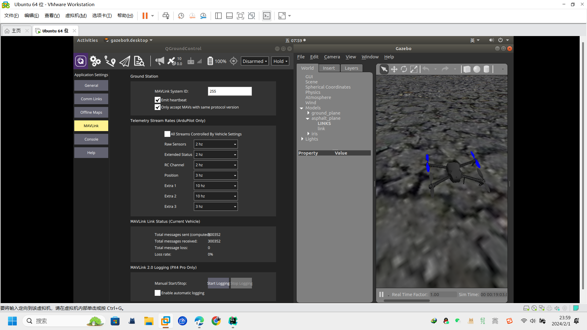

# 2月1日规划
## 目前规划
* 示意图

### 飞控部分
+ 这里不熟悉的地方都比较多，而且目前没有实物，假期以理论学习为主
+ 目前我看的主要是PX4，感觉应该PX6和PX4差不太多，下面都是从PX4出发的看法
+ 这个主要分成驱动模块和后期调参
  + 驱动模块：
    1. rk3588安装ubuntu18.04系统和ros，配置各种环境（应该大部分配好了）
    2. 了解mavlink协议，在之后能够通过mavros发布话题，驱动PX4
    3. 留出QGC接口，并且能够切换到地面站控制
  + 后期调参：
    1. 在模块能够正常通讯之后，需要进行一些参数的调整，具体我也不清楚，但好像是可以直接通过qgc就能调，这个可以留到开学再去调
    2. 电控如果假期能够把ros和通讯协议搞定，那么可以尝试一下仿真，下面给了一个完整的镜像，这个教程也比较详细，可以试试，仿真时的调参过程，应该和咱们实际调参的过程差不多。
     
        https://www.bilibili.com/video/BV1gm4y1g7gS/

+ 这玩意具体怎么用，现在我也不是很熟悉
  
+ 假期任务：
  1. 不熟悉ROS的需要去看一看ros，简单了解一下就可以（这个最好每个人都去做）
      * 最低要求过年之前弄完
  2. 搞电控的，需要去了解一下mavlink的协议，不用很深，知道怎么控制PX4就可以了（这个最好弄电控的都去看了，）
      + 最低要求：来学校之前看完
  3. QGC+ROS+PX4代码，熟悉这一套的控制，这一部分代码也可以在家里写了
      + 到学校后，能在一周之内让无人机飞起来
  4. 后续电控需要留下几个人专门调参，随着进度的进行，最好能够依次实现在平地，穿过各种障碍物的途中，都能实现平稳飞行，后续如果有更好的控制算法等，也可以进一步调试
  

### 视觉部分（rk3588的部分）
* 目前我的了解，大多数采用的是d435i进行建图，t265进行定位，现在由于相机数量限制，以及咱们还有个三维激光雷达，所以准备用三维雷达建图
* 下面是我的控制思路，这个思路可能有理论性的错误，后续估计也会不断更改：
  * 三维雷达slam建图 --->  ego_planner路径规划
  * ORB_SLAM3建图定位(双目+imu) ---> pid等追踪生成路径
  * 快到大致位置的时候，由v831接管
* 我目前的想法大概是这个，关于是否需要esdf地图等，都需要根据实际的运行情况加以判断
* 视觉识别方面，跑神经网络什么的都可以，不过我感觉目标特征比较明显，opencv用颜色或者模板匹配的函数，应该也行，这个不是特别复杂，到时候可以两手准备
* 精度不够，算法跑不动等情况的话，我感觉能用钱解决的事，就先不费脑子了
* 假期任务：
  1. ros的任务同上
  2. 目前有自己任务的先完成自己的任务
  3. slam的简单算法，最好了解一下，可以配置一下slam的环境，手头如果有相机，可以简单跑一个试试
  4. 使用opencv做一些简单的任务，调用一些包等；用pytorch等训练一些简单的识别的网络等
  5. 这些东西有点玄学，就不设置最低截止时间了
### 机械部分
+ 我对这边了解的不是很多，所以我也不知道大概怎么弄
+ 如果说后续机械任务比较多的话，你们可以自己专注于自己的任务就行
+ 如果比较少的话，其实就可以和我们一起讨论一下控制的逻辑，因为这个控制逻辑，就算不知道什么是ros，也可以凭借日常经验一起出谋划策的
